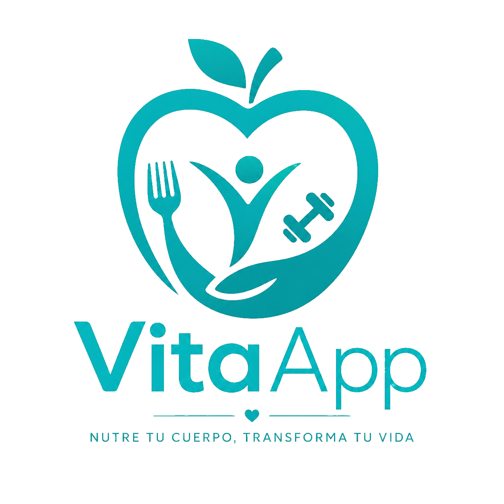

<div align="center">



# VitaApp 🍏💪

### _Nutre tu cuerpo, transforma tu vida._

Diario inteligente de **calorías y entrenamientos** para Android, con **escaneo de comida por IA**.

<br/>


<sub>Proyecto académico · Programación Orientada a Objetos 2 · Universidad Americana (UAM)</sub>

</div>

---

## 📖 Sobre el proyecto

**VitaApp** es una aplicación **Android nativa** (Kotlin + Jetpack Compose) para llevar un **diario de calorías y entrenamientos**. El usuario registra las comidas y ejercicios de cada día, ve sus calorías y macronutrientes, fija una meta personalizada, y hasta puede **escanear un plato con la cámara** para que una IA lo reconozca y lo registre automáticamente.

La app consume una **API REST propia** (Node/Express + Prisma + PostgreSQL) desplegada en la nube, que integra **Google Gemini** para el análisis de imágenes.

---

## ✨ Funcionalidades

<table>
<tr>
<td width="50%" valign="top">

### 🔐 Autenticación y sesión
- Registro e inicio de sesión con validación.
- **Token JWT** persistido de forma segura (DataStore) con **"Recordarme"**.
- **Auto-login**: el token se **valida** contra el servidor al reabrir; si expiró, cierra la sesión solo.
- Logout que limpia token y datos en memoria.

### 📅 Diario de comidas y ejercicios
- **Catálogo público** con buscador en vivo.
- **CRUD completo**: agregar, editar, eliminar.
- **Eliminar deslizando** (swipe-to-delete).
- **Filtro por fecha** (día anterior / siguiente / hoy).

</td>
<td width="50%" valign="top">

### 📊 Cálculos nutricionales
- Calorías **consumidas** y **quemadas** por día.
- **Macros**: proteínas, carbohidratos y grasas.
- **Meta diaria** personalizable + **calorías restantes** (rojas al pasarte).
- Formato de miles legible (`1,044`).

### 🤖 Escaneo de comida con IA
- Captura por **cámara** (`FileProvider`) o **galería**.
- La imagen se normaliza a JPEG y va al endpoint `/analyze`.
- **Google Gemini** detecta los alimentos, estima gramos y hace *match* con el catálogo.

</td>
</tr>
</table>

> 🎨 **Diseño:** Material 3 con tema **teal** propio (claro y oscuro), dashboard con **anillo de progreso** de calorías, tarjetas suaves y snackbars rediseñados.

---

## 🏗️ Arquitectura

La app sigue el patrón **MVVM** con capas separadas, donde cada capa solo conoce a la de abajo:

```
UI (Composables)  →  ViewModel  →  Repository  →  API (Retrofit)  →  Backend
   pinta estado       lógica +        puerta a       llamadas HTTP
                       estado          los datos
```

```
app/src/main/java/com/example/vita_app/
├── data/
│   ├── remote/model/     # Modelos (data classes + Gson)
│   ├── remote/api/       # Interfaces Retrofit (endpoints)
│   ├── repository/       # Repositorios (envuelven la API + token)
│   ├── RetrofitHelper    # Cliente HTTP (singleton)
│   ├── TokenManager      # Token en memoria
│   └── TokenStore /      # Persistencia con DataStore
│       GoalStore
└── ui/
    ├── screen/           # Pantallas + ViewModels (login, home, diary, meals, workouts, image)
    ├── components/       # Componentes reutilizables
    ├── navigation/       # Rutas type-safe + NavHost
    ├── theme/            # Color, tipografía y formas
    └── util/             # Funciones auxiliares (fecha, formato, etiquetas)
```

---

## 🌐 La API (backend)

VitaApp se conecta a un **backend propio y separado**, desplegado en la nube.

<div align="center">


</div>

- **Base URL:** `https://vita-app-api.onrender.com/api/`
- **Stack:** Node.js + **Express** (ESM), **Prisma ORM**, **PostgreSQL**, y **Google Gemini** (`gemini-2.5-flash`) para análisis de imágenes.
- **Autenticación:** **JWT** con expiración de 2 horas. Las rutas privadas requieren `Authorization: Bearer <token>`.

### Endpoints principales

| Método | Ruta | Auth | Descripción |
|:---|:---|:---:|:---|
| `POST` | `/auth/register` | ❌ | Crear cuenta |
| `POST` | `/auth/login` | ❌ | Iniciar sesión → devuelve el JWT |
| `GET` | `/meals` | ❌ | Catálogo de comidas (público) |
| `GET` | `/workouts` | ❌ | Catálogo de ejercicios (público) |
| `GET · POST · PUT · DELETE` | `/entries` | ✅ | Entradas de comida del diario |
| `GET · POST · PUT · DELETE` | `/workout-entries` | ✅ | Entradas de ejercicio del diario |
| `POST` | `/analyze` | ✅ | Sube una imagen (`multipart/form-data`) y devuelve los alimentos detectados por IA |

> 🔍 El pipeline de `/analyze` recibe la imagen, la redimensiona (`sharp`), la envía a Gemini con un esquema de respuesta estructurado, y mapea los alimentos detectados contra el catálogo antes de responder.

Como la API está **desplegada**, la app funciona tanto en **emulador** como en **dispositivo físico** sin configuración de red adicional.

---

## 🛠️ Tecnologías

| Categoría | Tecnología |
|:---|:---|
| Lenguaje | **Kotlin** |
| UI | **Jetpack Compose** + **Material 3** |
| Arquitectura | **MVVM** · `ViewModel` · corrutinas + `Flow` |
| Red | **Retrofit 2.9** + convertidor **Gson** |
| Navegación | **Navigation Compose 2.8.3** (rutas type-safe con `kotlinx.serialization`) |
| Persistencia local | **DataStore Preferences** |
| Concurrencia | **Kotlin Coroutines** |
| Build | **Gradle** (Kotlin DSL) |

**Requisitos:** `minSdk 26` · `targetSdk 36` · `compileSdk 37` · Android Studio reciente + JDK 11

---

## ▶️ Cómo ejecutar la app

```bash
# 1. Clonar el repositorio
git clone https://github.com/mrstevengz/Vita-App.git
```

2. **Abrir en Android Studio:** `File > Open` → seleccionar la carpeta clonada.
3. **Sincronizar Gradle:** esperar a que se descarguen las dependencias.
4. **Ejecutar:** conectar un dispositivo físico (depuración USB) o iniciar un emulador (AVD), y presionar **Run** (`Shift + F10`).

> ℹ️ No hace falta levantar el backend localmente: la app apunta a la API desplegada por defecto.

---

## 👥 Colaboradores

Estudiantes de la Facultad de Ingeniería y Arquitectura — Universidad Americana (UAM):

| Integrante | Rol |
|:---|:---|
| **Gabriela Michelle Guerrero Paiz** | Desarrolladora / Arquitecta de Software |
| **Steven Leonel Sequeira Reyes** | Líder de proyecto / Desarrollador |
| **Franco Xavier Aguilera Ortez** | Desarrollador / Documentador |

<div align="center">
<sub>Hecho con 💚 para la Universidad Americana (UAM)</sub>
</div>
